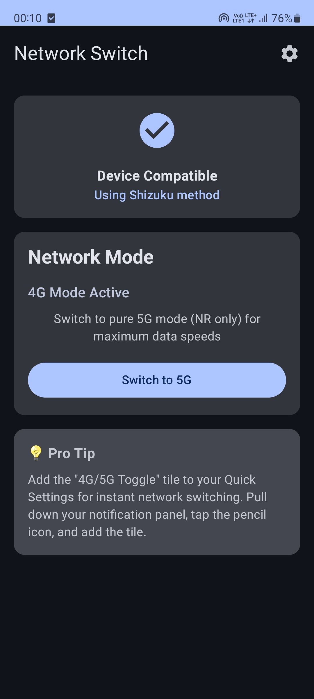
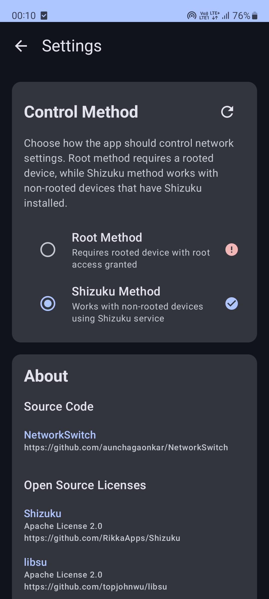

<div align="center">

<h1>Network Switch</h1>
<p>Modern Android app for 4G/5G network mode switching</p>

[](https://github.com/aunchagaonkar/NetworkSwitch/actions)
[](https://github.com/aunchagaonkar/NetworkSwitch/blob/main/LICENSE)
[](https://github.com/aunchagaonkar/NetworkSwitch/releases)
[](https://github.com/aunchagaonkar/NetworkSwitch/releases/latest)

</div>

---

A modern Android application that enables users to toggle between 4G and 5G network modes with dual control methods: Root access for rooted devices and Shizuku for non-rooted devices. Built using Jetpack Compose and Material Design 3.

## Purpose

Network Switch allows Android users to manually control their device's network preference between pure 4G (LTE-only) and 5G (NR-only) modes. This is useful for:

- Quick network switching through Quick Settings tile
- Optimizing battery life by forcing 4G mode
- Maximizing speed by forcing 5G mode where available
- Managing data usage and connectivity preferences

The app provides two methods of operation:
- **Root Method**: Direct system access for rooted devices
- **Shizuku Method**: System access through Shizuku service for non-rooted devices

## Features

- Pure network mode switching (LTE-only for 4G, NR-only for 5G)
- Quick Settings tile for instant access
- Dual control methods (Root and Shizuku)
- Modern Material Design 3 interface
- Clean architecture implementation
- Privacy-focused (no internet permissions)
- Intelligent device compatibility detection
- Automatic fallback for unsupported devices

## Screenshots

<div align="center">


</div>

## Requirements

### Root Method
- Rooted Android device (Android 10+)
- Root permissions granted to the app

### Shizuku Method
- Non-rooted Android device (Android 10+)
- Shizuku app installed and running
- ADB or Wireless ADB access to start Shizuku

## Installation
<div align="center">

[](https://github.com/aunchagaonkar/NetworkSwitch/releases)
[](https://apt.izzysoft.de/packages/com.supernova.networkswitch)
[](https://apps.obtainium.imranr.dev/redirect?r=obtainium://add/https://github.com/aunchagaonkar/NetworkSwitch/)

</div>
1. Download the latest APK from the Releases page
2. Install on your Android device
3. Choose your preferred control method:
   - **Root**: Grant root permissions when prompted
   - **Shizuku**: Install Shizuku app and grant permission
4. Add the "4G/5G Toggle" tile to Quick Settings

## Project Structure

```
app/
├── src/main/java/com/supernova/networkswitch/
│   ├── presentation/          # UI Layer
│   │   ├── ui/               # Compose UI components
│   │   ├── viewmodel/        # ViewModels
│   │   └── theme/            # Material Design theme
│   ├── domain/               # Business Logic Layer
│   │   ├── model/            # Domain models
│   │   ├── repository/       # Repository interfaces
│   │   └── usecase/          # Business use cases
│   ├── data/                 # Data Layer
│   │   ├── repository/       # Repository implementations
│   │   ├── source/           # Data sources (Root, Shizuku)
│   │   └── preferences/      # Settings storage
│   ├── service/              # System Services
│   │   ├── tile/             # Quick Settings tile
│   │   └── network/          # Network management
│   └── di/                   # Dependency Injection modules
├── build.gradle.kts          # App build configuration
└── proguard-rules.pro        # ProGuard rules

hiddenapi/                    # Android Hidden API access
├── src/main/aidl/            # AIDL interfaces
└── build.gradle.kts          # Hidden API build config

.github/workflows/            # CI/CD pipelines
├── ci.yml                    # Continuous Integration
└── build-release.yml         # Release workflow

gradle/
├── libs.versions.toml        # Version catalog
└── wrapper/                  # Gradle wrapper

build.gradle.kts              # Root build configuration
settings.gradle.kts           # Project settings
```


## Building from Source

```bash
# Clone the repository
git clone https://github.com/aunchagaonkar/NetworkSwitch.git
cd NetworkSwitch

# Build debug APK
./gradlew assembleDebug

# Build release APK
./gradlew assembleRelease
```

## TODO
- [x] Add unit tests for all core components
- [ ] Add network speed monitoring
- [ ] Implement network statistics tracking
- [ ] Add support for 3G fallback modes
- [ ] Add multi-language support
- [ ] Implement network signal strength indicators
- [ ] Add scheduled network switching
- [ ] Add network performance benchmarking

## Contributing

Contributions are welcome! Please follow these guidelines:

### Getting Started
1. Fork the repository
2. Create a feature branch (`git checkout -b feature/feature-name`)
3. Make your changes following the project's code style
4. Test your changes thoroughly
5. Commit your changes (`git commit -m 'Add feature-name'`)
6. Push to the branch (`git push origin feature/feature-name`)
7. Open a Pull Request

### Code Style
- Follow Kotlin coding conventions
- Use meaningful variable and function names
- Add documentation for public APIs
- Maintain clean architecture principles
- Follow Material Design guidelines for UI changes

### Testing
This project includes a suite of unit tests to ensure code quality and stability.

To run the unit tests, execute the following command from the root of the project:

```bash
./gradlew test
```

- Add unit tests for new functionality
- Test on both rooted and non-rooted devices
- Verify compatibility across different Android versions
- Test network switching functionality thoroughly

### Reporting Issues
- Use the GitHub issue tracker
- Provide detailed reproduction steps
- Include device information and Android version
- Attach relevant logs when possible

## LICENSE

This project is licensed under the GNU General Public License v3.0. See the [LICENSE](LICENSE) file for details.

## Dependencies and Credits

### Core Dependencies
- **Shizuku**: Root-less system API access
- **libsu**: Root access management
- **Hilt**: Dependency injection
- **DataStore**: Modern preferences storage
- **Jetpack Compose**: Modern UI framework
- **Material Design 3**: UI components and theming
- **Kotlin Coroutines**: Asynchronous operations

Special thanks to the Android development community and the maintainers of the open-source libraries used in this project.
